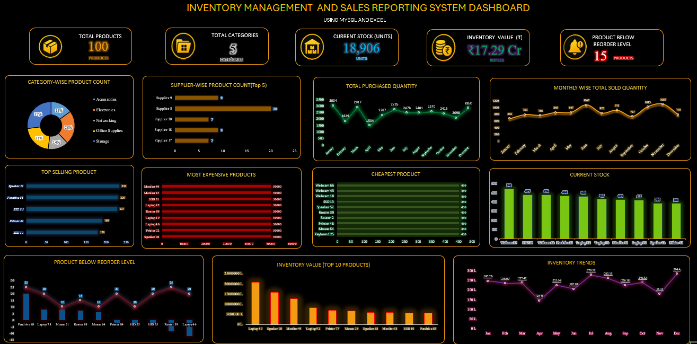

# Inventory Management & Sales Reporting System

## 📌 Project Overview

This project is an Inventory Management and Sales Reporting System developed using MySQL and Microsoft Excel.

The project uses SQL to create and manage inventory-related tables, import and verify data, perform data analysis, and generate reports. The analyzed data is then used in Microsoft Excel to create an interactive dashboard for inventory and sales reporting.

## 🛠️ Tools & Technologies

- MySQL
- SQL
- Microsoft Excel
- Pivot Tables
- Pivot Charts
- Excel Dashboard
- CSV Data

## 🗂️ Database Structure

The MySQL database contains the following tables:

- Categories
- Suppliers
- Products
- Purchases
- Sales

Relationships between the tables were created using Primary Keys and Foreign Keys.

## 🔍 SQL Analysis

The project includes SQL queries for:

- Creating the database
- Creating tables
- Importing CSV data
- Verifying data
- Viewing table data
- Filtering products
- Sorting products by price
- Finding top expensive products
- Aggregate functions
- Category-wise product analysis
- Joining product, category, and supplier information

### SQL Concepts Used

- CREATE DATABASE
- CREATE TABLE
- PRIMARY KEY
- FOREIGN KEY
- SELECT
- WHERE
- ORDER BY
- LIMIT
- COUNT()
- AVG()
- MAX()
- MIN()
- GROUP BY
- JOIN

## 📊 Excel Dashboard

The analyzed inventory and sales data was used to create an Excel dashboard containing KPI cards, charts, and visual reports.

### Key Dashboard Metrics

- Total Products
- Total Categories
- Current Stock
- Inventory Value
- Product Reorder Analysis
- Category-wise Product Count
- Supplier-wise Product Analysis
- Stock Analysis
- Monthly Sales Analysis
- Top Selling Products
- Most Expensive Products
- Cheapest Products

## 📸 Dashboard Preview

## 📂 Project Files

- `Inventory_MIS_Project_FINAL.xlsx` – Final Excel dashboard
- `SQL/` – SQL queries used in the project
- `SQL_Reports/` – SQL analysis reports
- `Data/` – Project data files
- `Dashboard/` – Dashboard screenshot

## 🎯 Project Objective

The objective of this project is to demonstrate practical skills in SQL, MySQL, Excel, data analysis, reporting, and dashboard creation.

This project was developed as a practical portfolio project for MIS Executive and Data Analyst roles.

## 💡 Skills Demonstrated

- Data Analysis
- SQL Querying
- Database Management
- Data Cleaning and Verification
- Reporting
- Excel Dashboard Development
- Data Visualization
- Inventory Analysis
- Sales Analysis

